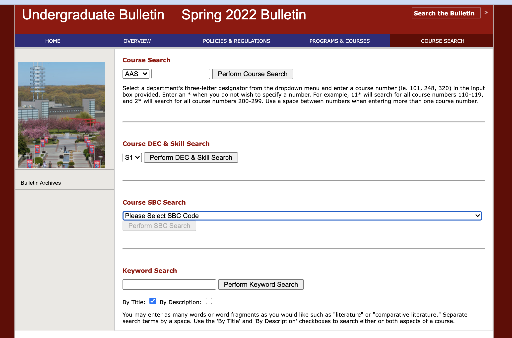

# Stonybrook University Course Search

## Why do I need?

> A picture is worth a thousand words

- bad UI
- too much time spent (to search)
- bad readability

## Run!

1. clone the repo
2. install nodejs and yarn (if you haven't)
3. go to the project root dir (that `package.json` file located)
4. open terminal and type `yarn start`
5. DONE!
